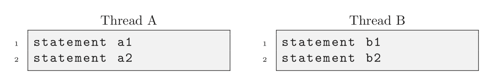

## This repository is based on the problems from the book [Little Book of Semaphores](http://greenteapress.com/semaphores/LittleBookOfSemaphores.pdf)

I am adding solutions in java, feel free to contribute to this repository by improving the solution or adding the solution in any other language.

Below is the problem description and link to their solutions.

### Chapter 3: Basic Synchronization Patterns

_**Problem 1:**_ Consider two threads A and B. Thread B should wait for signal from Thread A before execution.
[Java Solution](Chapter_Three_Basic_Synchronization_Patterns/Signal.java)

_**Problem 2:**_ Generalize the signal pattern so that it works both ways. Thread A has to wait for Thread B and vice versa. In other words, given below code, we want to guarantee that a1 happens before b2 and b1 happens before a2.

[Java Solution](Chapter_Three_Basic_Synchronization_Patterns/Rendezvous.java)

_**Problem 3:**_ Add semaphores to the following example to enforce mutual exclusion to the shared variable count.
 [Java Solution](Chapter_Three_Basic_Synchronization_Patterns/Mutex.java)
 
_**Problem 4:**_ Generalize the Mutex solution so that it allows multiple threads to run in the critical section at the same time, but it enforces an upper limit on the number of concurrent threads. In other words, no more than n threads can run in the critical section at the same time.
[Java Solution](Chapter_Three_Basic_Synchronization_Patterns/Multiplex.java)

_**Problem 5:**_ Generalize the rendezvous solution. The synchronization requirement is that no thread executes critical point until after all threads have executed rendezvous. You can assume that there are n threads and that this value is stored in a variable, n, that is accessible from all threads. When the first n − 1 threads arrive they should block until the nth thread arrives, at which point all the threads may proceed.Rewrite the barrier solution so that after all the threads have passed through, the turnstile is locked again.
[Java Solution](Chapter_Three_Basic_Synchronization_Patterns/Barrier.java)